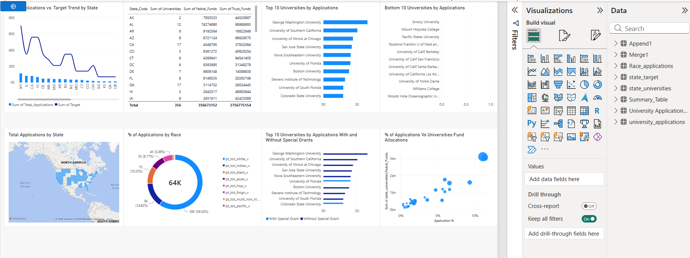
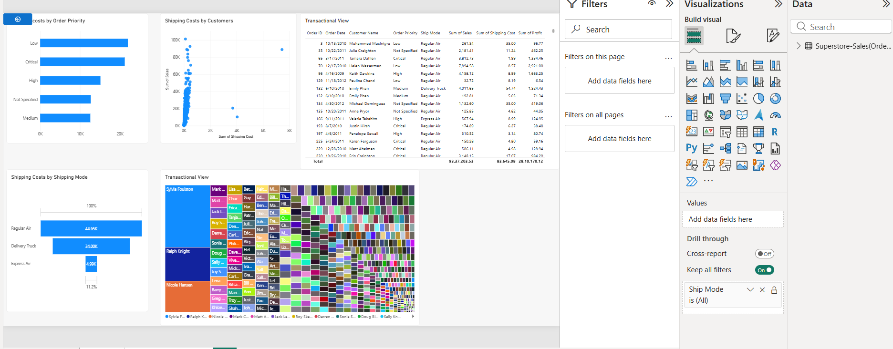

# Capstone Project 2 – Power BI

This project was completed as part of my Power BI certification program.

## Project Overview

This project demonstrates data transformation, data modelling, and interactive data visualization using Power BI.

### 1. University Admissions Analysis

- Data transformation using Power Query
- Data merging, appending, splitting, pivoting and unpivoting
- Data modelling and relationships
- DAX calculations
- Analysis of university applications, targets, funds and grants
- Interactive Power BI dashboards

### 2. Superstore Sales Analysis

- Shipping cost analysis
- Order priority analysis
- Shipping mode analysis
- Customer-level analysis
- Transactional data analysis
- Interactive dashboard and treemap visualization

## Key Skills Demonstrated

- Power BI Desktop
- Power Query
- DAX
- Data Transformation
- Data Modelling
- Data Visualization
- Dashboard Development

## Dashboard Preview

### University Admissions Dashboard

### Superstore Sales Dashboard

## Files Included

- `Capstone_Project_2_University_Admissions.pbix`
- `Capstone_Project_2_Superstore_Sales.pbix`
- `University_Admissions_Dashboard.png`
- `Superstore_Sales_Dashboard.png`

## Note

This project was completed as part of a Power BI certification program and is included in this repository as part of my learning and portfolio work.
